# Thinkful API Hack Capstone - Dinner and a Movie Web App

## Programmer
Chanda Hubbard

[>Live URL<](https://chandahubbard.github.io/API-Hack-Capstone/)

[>MVP<](https://chandahubbard.github.io/API%20Hack%20Capstone/index.html)

## Motivation

Sometimes you just want a nice relaxing night in, while ordering dinner and watching a good movie.  There are so many restaurants and movies to choose from, and it can be very hard to make a selection when there are so many good options.  This app was created to help users avoid the decision paralysis that happens when they need to deicde on a resturaunt to eat at, or when they need to decide on a movie to watch. The users will input thier location and the app will show the information for a takeout restaurant nearby.  Then the user will input a movie that they like and the app will show them a recommendation and trailer for a similar movie.

## Summary

Responsive web app that helps users decide where to order dinner and which movie to watch for a fun night in.  Users input their location and it is sent to the [EatStreet API Endpoint](https://developers.eatstreet.com/endpoint/search) to find restaurants that provide food delivery or pickup nearby. Users will then navigate to a screen where they can input a movie that they like so that they can receive similar movie recommendations using the [TasteDive Movie API Endpoint](https://tastedive.com/read/api) 

//A summary section. This should have a concise explanation of what your app does. Try to frame this from the standpoint of what the user does, or what the app enables for the user.


### Technologies Used:

#### HTML <br/>CSS <br/>Javascript <br/>jQuery <br/>Restful APIs <br/>Visual Studio Code <br/>Git Hub

##### [> Initial wireframes<](https://docs.google.com/document/d/16hyz31opJRNBHMy4-gDB9pLsdS5OK1MZCCaQCb7vhCo/edit?usp=sharing)

##### [> Initial User Stories<](https://docs.google.com/spreadsheets/d/1FB6xBWHgIpJLK6rlRdFN-CHQ4ed_Hvct-nbLKT8k22w/edit?usp=sharing)

### Version MVP (Minimal Viable Product)

#### Image of MVP Title Screen


#### Image of MVP Results Screen


#### Wireframe images


#### With a little bit of CSS

After researching the Psychology of Color, I decide that I would either choose a red or orange color scheme for my styling.  Red, because it symbolizes entertainment, for the movie portion of the app. Or Orange, because it symbolizes food/hunger, for the food delivery portion of the app.  I ended up with a red based color scheme called,  [Color theme: Adobe Sosialisasi Speak Up 19](https://color.adobe.com/Sosialisasi-Speak-Up-19-color-theme-14114879/https://color.adobe.com/Sosialisasi-Speak-Up-19-color-theme-14114879/) , which you can view below.

<br/>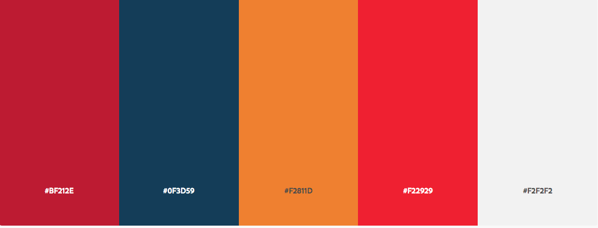

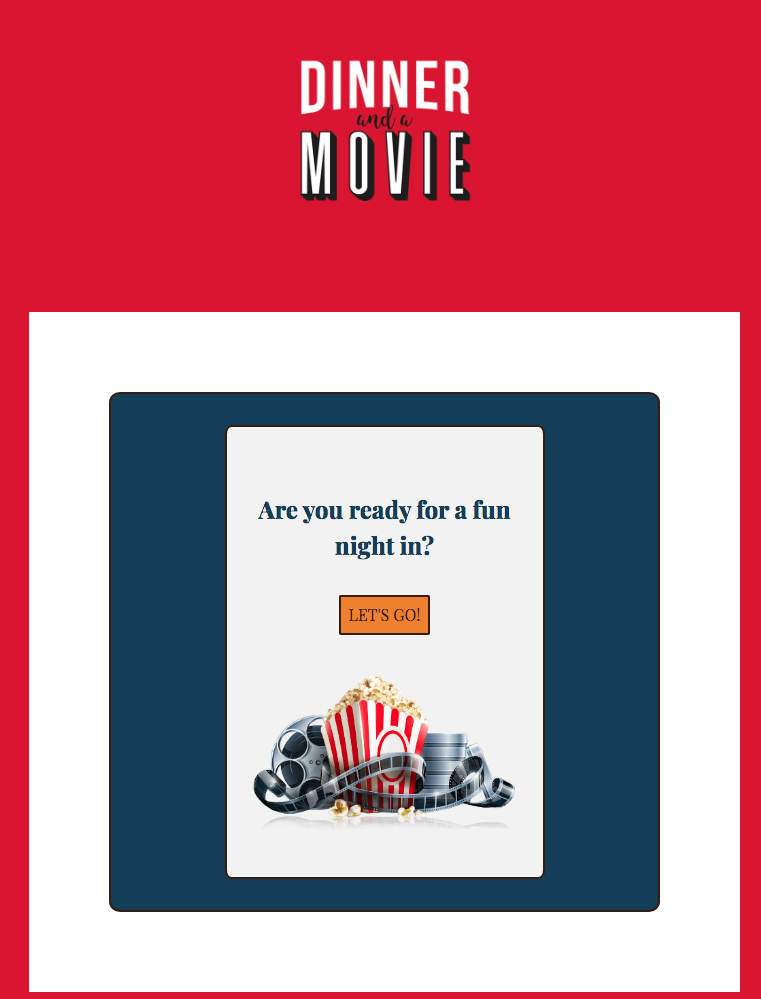<br/>

## Final version

### Mobile

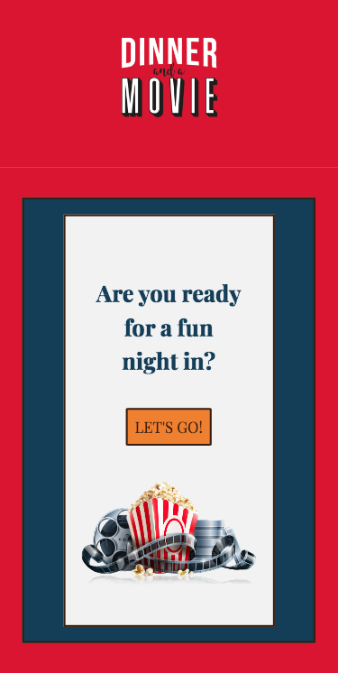

### Tablet

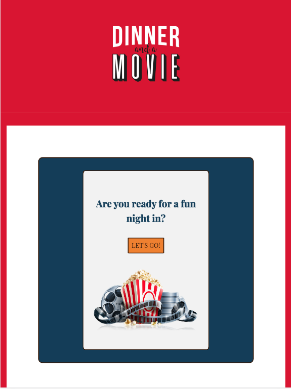

### Desktop/other

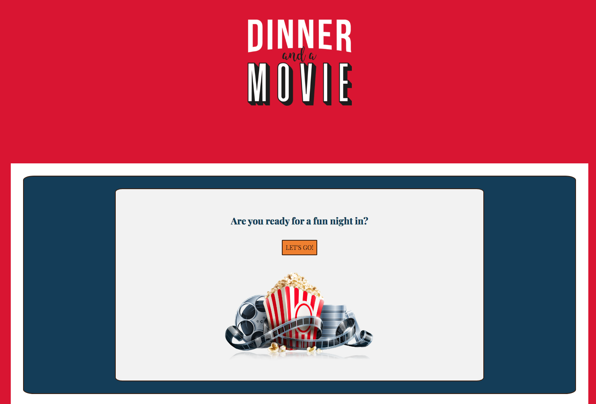

# Final version & User Flows


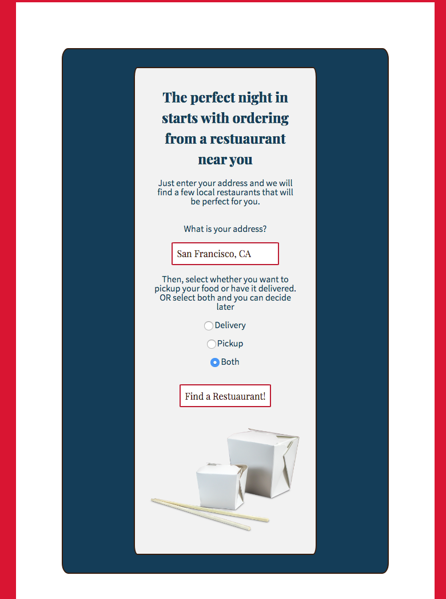
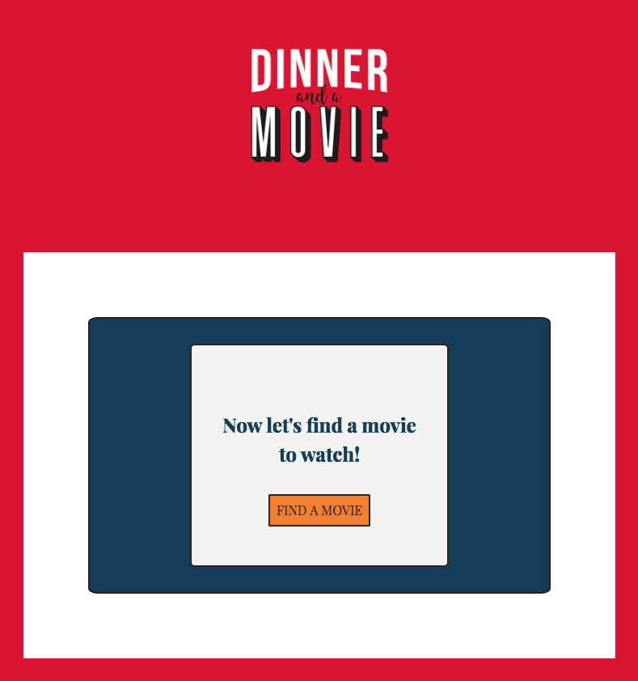
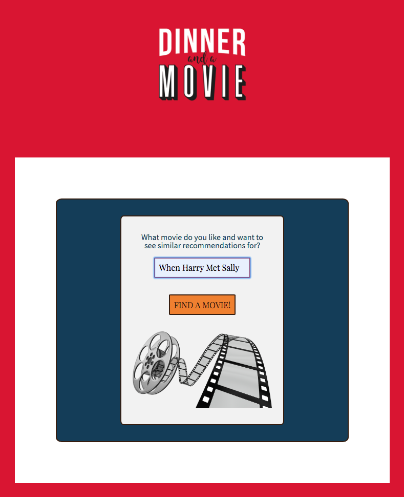
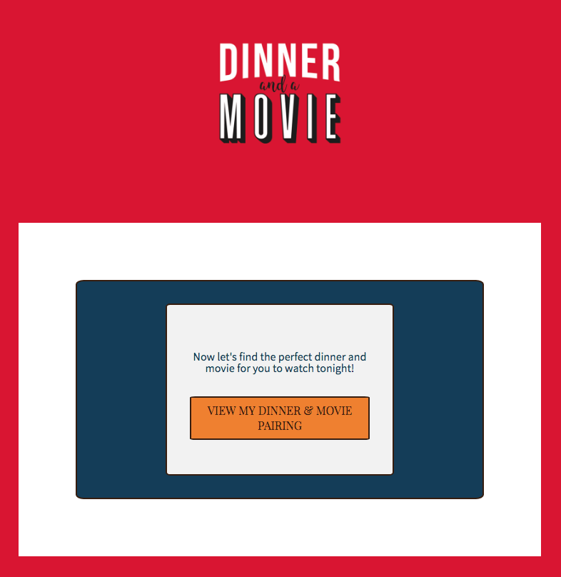
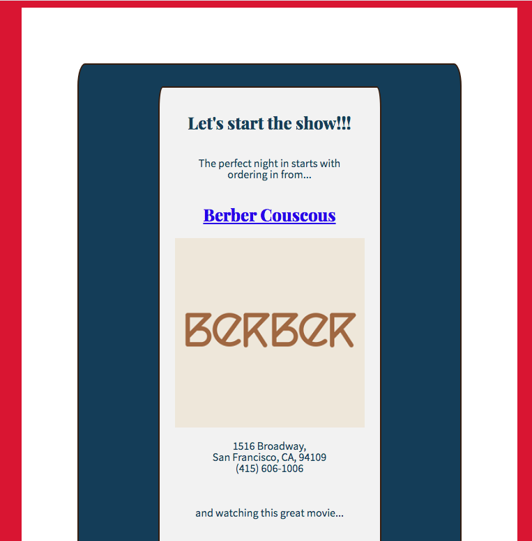
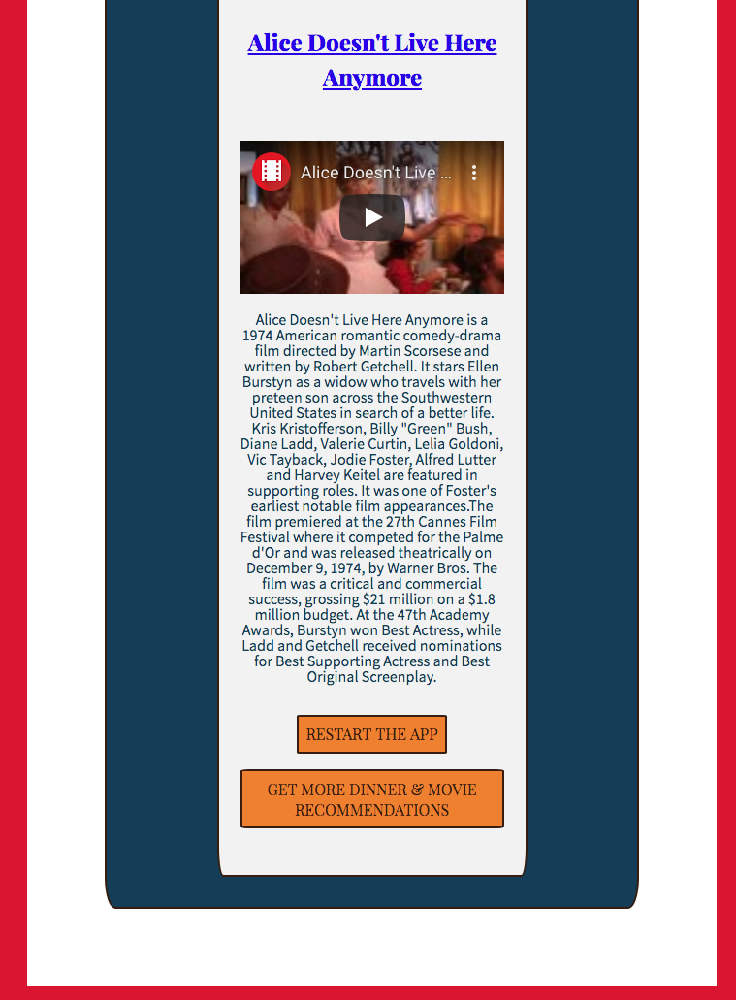


<!-- 

<!-- ## Build Status

<!-- 

<!-- ## Screenshots
Login Screen/Landing Page:

<!-- 

<!-- About:

<!-- 

<!-- Library:

<!-- 

<!-- Recommendations:

<!-- 

<!-- ## Environment Setup

<!-- 1. Setup your own postgress server
2. Run the database_script.sql file to build your table structure
3. Create a .env file in your server folder which contains the path to your database as well as your client id and secret
4. Obtain a client id and secret by setting up your app with [the google developers console](https://console.developers.google.com/)
5. Run your project with
```
npm run dev
```

<!-- ## Running the tests

<!-- To run all tests, run
```
<!-- npm test
```
To run just the front/back end tests, run
```
npm run test:server

<!-- npm run test:client
```

<!-- ## Built With

<!-- ### Front-End
* React
* Redux
* React-Router

<!-- ### Back-End
* Postgress
* Express
* Node
* Knex

<!-- ### Testing
* Mocha
* Chai
* Chai-http
* Jest

## Features

<!-- * Create a list of books
* Add your favorite books
* Like lists to get recommendations
* See every book currently in the library

