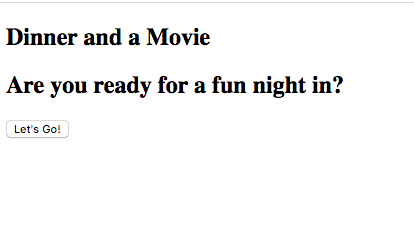
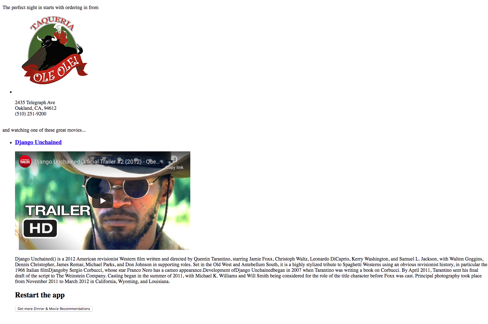
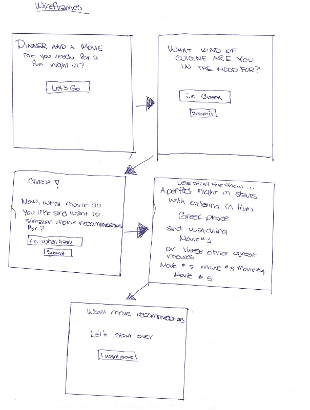

# Thinkful API Hack Capstone - Dinner and a Movie

## Programmer
Chanda Hubbard

[>Live URL<](https://chandahubbard.github.io/API-Hack-Capstone/index.html)

[>MVP<](https://chandahubbard.github.io/API%20Hack%20Capstone/index.html)

Responsive web app that helps users decide where to order dinner and which movie to watch for a fun night in.  Users input their location and it is sent to the [EatStreet API Endpoint](https://developers.eatstreet.com/endpoint/search) to find restaurants that provide food delivery or pickup nearby. Users will then navigate to a screen where they can input a movie that they like so that they can receive similar movie recommendations using the [TasteDive Movie API Endpoint](https://tastedive.com/read/api) 


### Technologies Used:

#### HTML <br/>CSS <br/>Javascript <br/>jQuery <br/>Restful APIs <br/>Visual Studio Code <br/>Git Hub

##### [> Initial wireframes<](https://docs.google.com/document/d/16hyz31opJRNBHMy4-gDB9pLsdS5OK1MZCCaQCb7vhCo/edit?usp=sharing)

##### [> Initial User Stories<](https://docs.google.com/spreadsheets/d/1FB6xBWHgIpJLK6rlRdFN-CHQ4ed_Hvct-nbLKT8k22w/edit?usp=sharing)

## Version MVP (Minimal Viable Product)

### Image of MVP Title Screen



### Image of MVP Results Screen



### Wireframe image



## With a little bit of CSS

[Color theme: Adobe Sosialisasi Speak Up 19](https://color.adobe.com/Sosialisasi-Speak-Up-19-color-theme-14114879/https://color.adobe.com/Sosialisasi-Speak-Up-19-color-theme-14114879/)


## Final version

### Mobile


### Desktop/other


<!-- A community driven, book recommendation application. Users can create lists of their favorite books and have others recommended to them.
A link to your live app
Screenshot(s) of your app. This makes your app description much easier to understand.
A summary section. This should have a concise explanation of what your app does. Try to frame this from the standpoint of what the user does, or what the app enables for the user.
A section on the technology used. For your capstone, this is fairly simple (HTML/CSS/JavaScript/jQuery) but it's still good to list out the key technologies.


<!-- ## Motivation

<!-- We wanted a book recommendation app that was community driven. Books and lists are all created by the users.

<!-- ## Build Status

<!-- 

<!-- ## Screenshots
Login Screen/Landing Page:

<!-- 

<!-- About:

<!-- 

<!-- Library:

<!-- 

<!-- Recommendations:

<!-- 

<!-- ## Environment Setup

<!-- 1. Setup your own postgress server
2. Run the database_script.sql file to build your table structure
3. Create a .env file in your server folder which contains the path to your database as well as your client id and secret
4. Obtain a client id and secret by setting up your app with [the google developers console](https://console.developers.google.com/)
5. Run your project with
```
npm run dev
```

<!-- ## Running the tests

<!-- To run all tests, run
```
<!-- npm test
```
To run just the front/back end tests, run
```
npm run test:server

<!-- npm run test:client
```

<!-- ## Built With

<!-- ### Front-End
* React
* Redux
* React-Router

<!-- ### Back-End
* Postgress
* Express
* Node
* Knex

<!-- ### Testing
* Mocha
* Chai
* Chai-http
* Jest

## Features

<!-- * Create a list of books
* Add your favorite books
* Like lists to get recommendations
* See every book currently in the library

